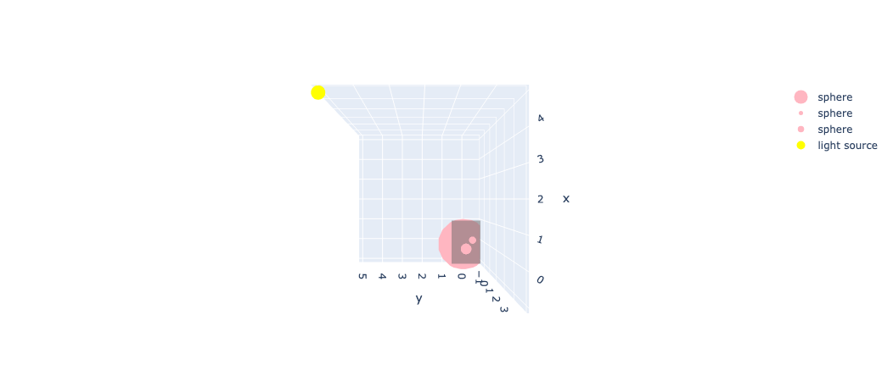
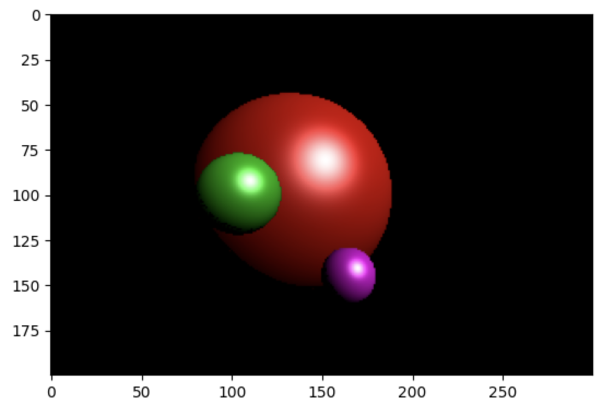

# Basic Ray Tracing in Python
In this repo, we implement basic ray tracing concepts from scratch in python, using only `numpy` and `matplotlib`. The goal is to understand the basic concepts of ray tracing, and to have a working code that can be used to test and experiment with different ideas.

## Installation and Setup
The code is written in Python 3.10, and uses only `numpy` and `matplotlib` and `tqdm`. If you want to see the 3D Scene and visualize it in the notebook, you need to install `plotly` too. To install the required packages, run the following command in the terminal:
```
pip install -r requirements.txt
```

## Usage
Simply try running `main.py` code to see the result image seen from the placed camera.
```
python main.py
```
You can also run the `main.ipynb` notebook to see some extra visualizations and explanations.

## Results
Here is a sample 3D Scene setup:


and here is the result image seen from the camera in this scene:


*Please Note* that we use the Blinn-Phong reflection model to calculate the color of surface seen from camera, considering the light source (see [here](https://en.wikipedia.org/wiki/Blinn%E2%80%93Phong_reflection_model))

## Contact
If you have any questions, or need a new feature to be added, please feel free to contact me with [my email](mailto:arazlighi@gmail.com).
